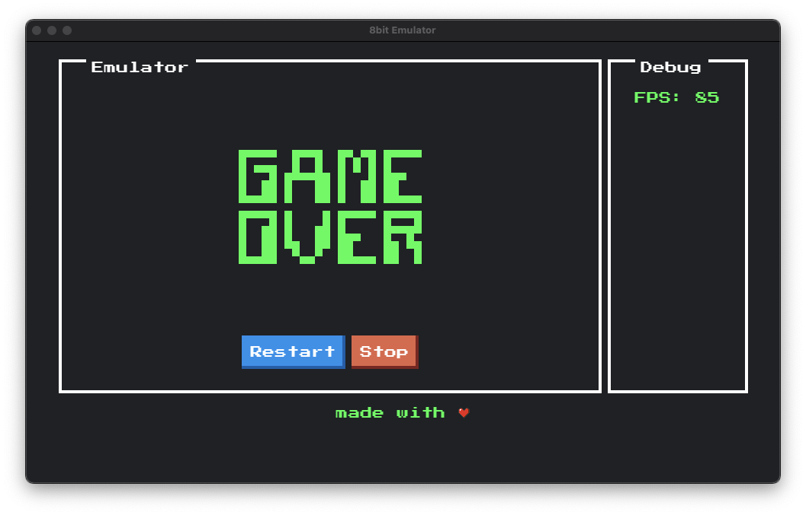

# chip8 emulator

A simple JavaScript chip8 emulator based on [electron](https://www.electronjs.org/) and [nodejs](https://nodejs.org/en/).

## Keyboard

| 1   | 2   | 3   | 4   |
| --- | --- | --- | --- |
| !   | @   | #   | $   |
| Q   | D   | R   | W   |
| A   | S   | H   | T   |
| Z   | X   | M   | C   |

## Usage

- Load chip8 via ROM Menu
- enjoy

## Techstack

chip8 emulator is based on [electron](https://www.electronjs.org/) and [preact](https://preactjs.com/). The UI was created with [NES.css](https://nostalgic-css.github.io/NES.css/). It is written with [typescript](https://www.typescriptlang.org/) and using [webpack](https://webpack.js.org/) as bundler.

Additional packages:

- different typings and webpackloaders

## Disclaimer

Have fun
